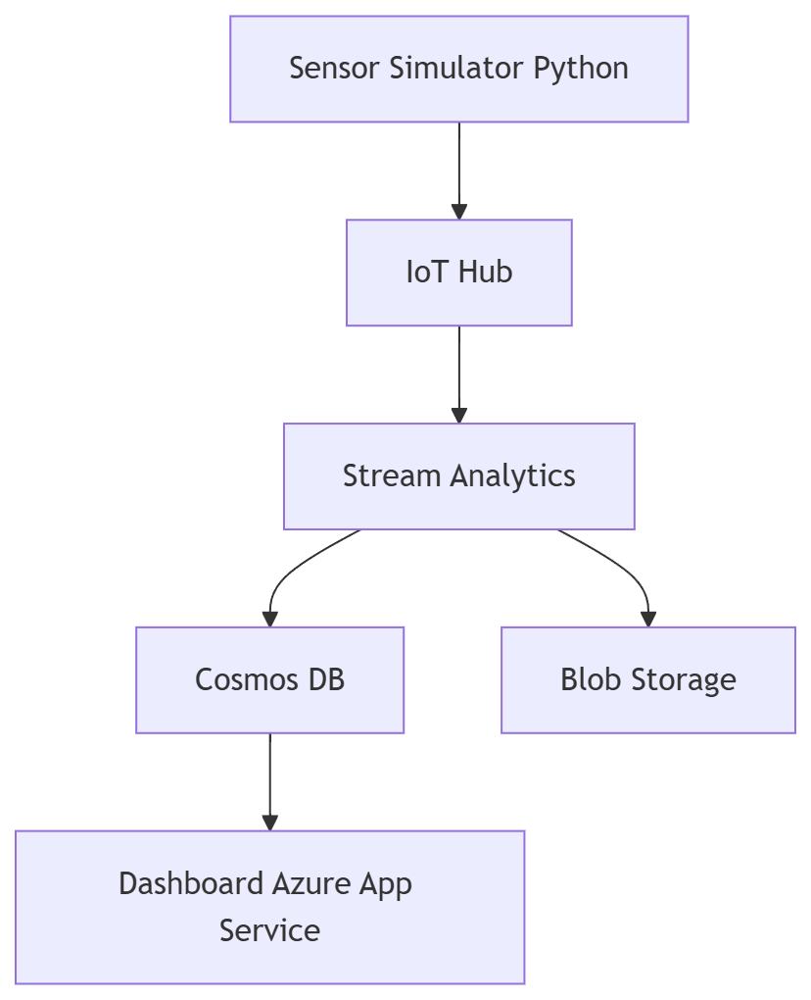

# Rideau Canal Monitoring System

## Project Title and Description

### Project Title
Rideau Canal Real-Time Monitoring System

### Description
This project is a real-time monitoring system that simulates IoT sensors along the Rideau Canal.  
It collects environmental data such as ice thickness and temperature, processes the data using Azure services, and displays the results on a web dashboard.

---

## Student Information

- Name: Jingjing Duan  
- Student ID: 041159829  

### Repository Links

- Sensor Simulation Repository: https://github.com/Jingjing-Duan/rideau-canal-sensor-simulation  
- Web Dashboard Repository: https://github.com/Jingjing-Duan/rideau-canal-dashboard  
- Main Documentation Repository: https://github.com/Jingjing-Duan/rideau-canal-monitoring  

---

## Scenario Overview

### Problem Statement
Monitoring ice conditions on the Rideau Canal is important for public safety.  
Manual monitoring is slow and cannot provide real-time updates.

### System Objectives
- Monitor multiple canal locations in real time  
- Detect unsafe ice conditions  
- Store and process environmental data  
- Display data through a web dashboard  

---

## System Architecture

### Architecture Diagram
See diagram in:  


---

### Data Flow
Sensor Simulation → Azure IoT Hub → Stream Analytics → Cosmos DB / Blob Storage → Web Dashboard

---

### Azure Services Used
- Azure IoT Hub  
- Azure Stream Analytics  
- Azure Cosmos DB  
- Azure Blob Storage  
- Azure App Service  

---

## Implementation Overview

### IoT Sensor Simulation
Simulates three IoT devices and sends real-time data to Azure IoT Hub.  
Repository: https://github.com/Jingjing-Duan/rideau-canal-sensor-simulation    

---

### Azure IoT Hub Configuration
Configured three devices, each with its own connection string.  
IoT Hub receives telemetry data from the simulator.

---

### Stream Analytics Job
Processes incoming data and sends it to storage.

#### Query
```sql
WITH AggregatedData AS
(
    SELECT
        [location],
        System.Timestamp() AS windowEndTime,
        AVG(iceThickness) AS avgIceThickness,
        MIN(iceThickness) AS minIceThickness,
        MAX(iceThickness) AS maxIceThickness,
        AVG(surfaceTemperature) AS avgSurfaceTemperature,
        MIN(surfaceTemperature) AS minSurfaceTemperature,
        MAX(surfaceTemperature) AS maxSurfaceTemperature,
        MAX(snowAccumulation) AS maxSnowAccumulation,
        AVG(externalTemperature) AS avgExternalTemperature,
        COUNT(*) AS readingCount
    FROM sensorinput TIMESTAMP BY timestamp
    GROUP BY
        [location],
        TumblingWindow(minute, 5)
),

FinalData AS
(
    SELECT
        CONCAT(
            [location], '-',
            REPLACE(REPLACE(REPLACE(CAST(windowEndTime AS nvarchar(max)), ':', ''), '-', ''), ' ', '')
        ) AS id,
        [location],
        windowEndTime,
        avgIceThickness,
        minIceThickness,
        maxIceThickness,
        avgSurfaceTemperature,
        minSurfaceTemperature,
        maxSurfaceTemperature,
        maxSnowAccumulation,
        avgExternalTemperature,
        readingCount,
        CASE
            WHEN avgIceThickness >= 30 AND avgSurfaceTemperature <= -2 THEN 'Safe'
            WHEN avgIceThickness >= 25 AND avgSurfaceTemperature <= 0 THEN 'Caution'
            ELSE 'Unsafe'
        END AS safetyStatus
    FROM AggregatedData
)

SELECT
    *
INTO cosmosoutput
FROM FinalData;

SELECT
    location,
    windowEndTime,
    avgIceThickness,
    minIceThickness,
    maxIceThickness,
    avgSurfaceTemperature,
    minSurfaceTemperature,
    maxSurfaceTemperature,
    maxSnowAccumulation,
    avgExternalTemperature,
    readingCount,
    safetyStatus
INTO bloboutput
FROM FinalData;
```

### Cosmos DB Setup
Stores processed sensor data for real-time access and historical analysis.

---

### Blob Storage Configuration
Stores raw data for backup and future processing.

---

### Web Dashboard
Displays real-time sensor data, safety status, and trends.  
Repository: https://github.com/Jingjing-Duan/rideau-canal-dashboard  

---

### Azure App Service Deployment
The web dashboard is deployed using Azure App Service for public access.

---

## Repository Links

- Sensor Simulation Repository: https://github.com/Jingjing-Duan/rideau-canal-sensor-simulation  
- Web Dashboard Repository: https://github.com/Jingjing-Duan/rideau-canal-dashboard  
- Main Documentation Repository: https://github.com/Jingjing-Duan/rideau-canal-monitoring  

---

## Video Demonstration

Video Link: [\[YouTube\]](https://youtu.be/FcgIQtk7VTk)

---

## Setup Instructions

### Prerequisites
- Azure account  
- Python installed  
- Node.js installed  

---

### High-Level Setup Steps
1. Run the sensor simulation  
2. Send data to Azure IoT Hub  
3. Process data using Stream Analytics  
4. Store data in Cosmos DB and Blob Storage  
5. Display data on the web dashboard  

---

### Detailed Setup Links
- Sensor setup: https://github.com/Jingjing-Duan/rideau-canal-sensor-simulation  
- Dashboard setup: https://github.com/Jingjing-Duan/rideau-canal-dashboard  

---

## Results and Analysis

### Sample Outputs and Screenshots

- Real-time sensor data is generated every few seconds  
- Dashboard displays current data and safety status  
- Screenshots  
1. IoT Hub Devices


2. IoT Hub Metrics


3. Stream Analytics Query


4. Stream Analytics Running


5. Cosmos DB Data


6. Blob Storage Files


7. Dashboard (Local)


8. Dashboard (Azure)


---

### Data Analysis
- Ice thickness values are categorized into Safe, Caution, and Danger  
- Data is continuously processed and stored  

---

### System Performance Observations
- Data is processed in near real-time  
- System remains stable during continuous data streaming  

---

## Challenges and Solutions

### Challenge 1: Managing multiple IoT devices  
Solution: Used separate device connection strings and managed them using environment variables  

---

### Challenge 2: Real-time data processing  
Solution: Used Azure Stream Analytics to process streaming data efficiently  

---

### Challenge 3: Securing sensitive data  
Solution: Stored connection strings in .env and excluded them using .gitignore  

---

## AI Tools Disclosure

### Tools Used
ChatGPT  

---

### How AI Was Used
Assisted in code structure and documentation writing  

---

### My Work
Implemented all components  
Configured Azure services  
Integrated the full system  

---

## References

### Libraries Used
- azure-iot-device  
- python-dotenv  

---

### Other Resources
- Azure IoT Hub documentation  
- Azure Stream Analytics documentation  