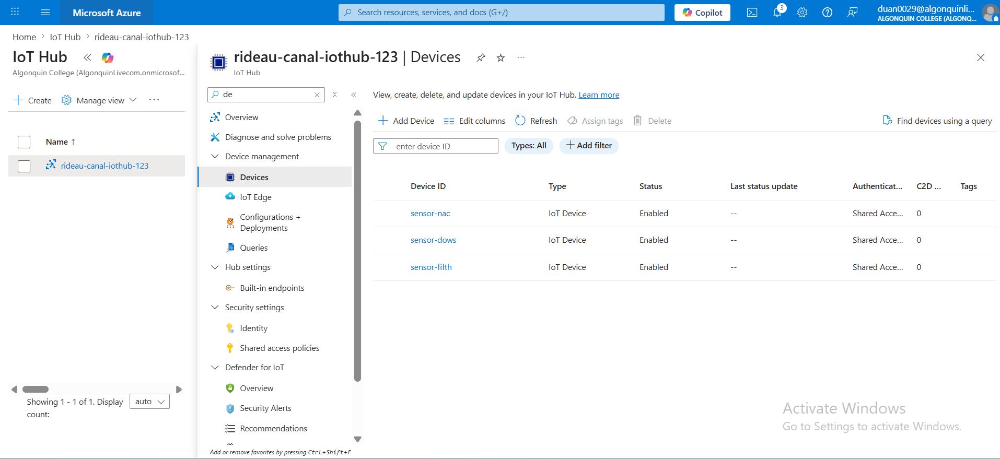
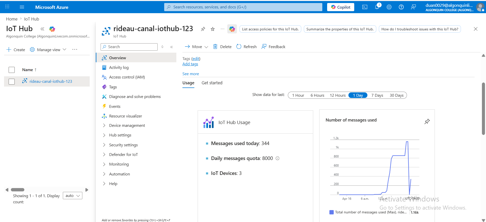
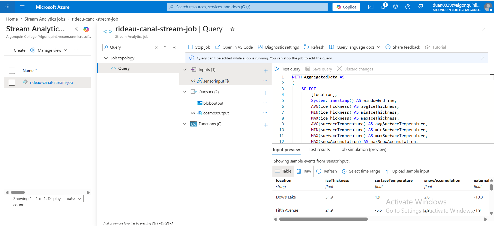
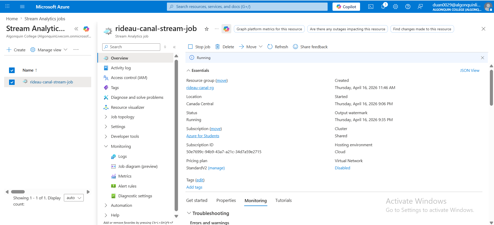
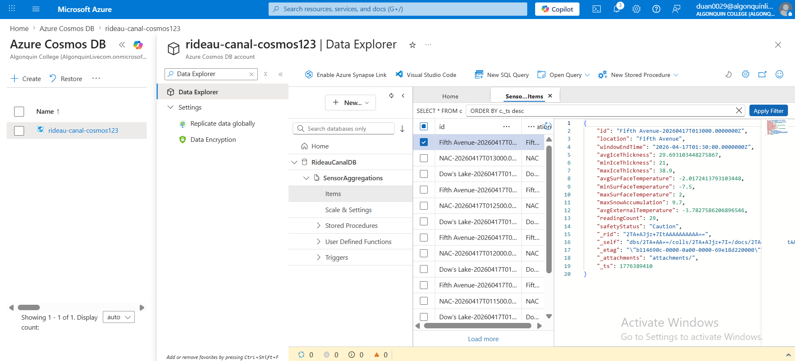
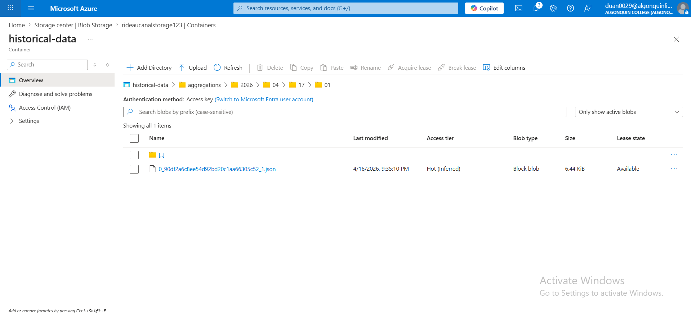
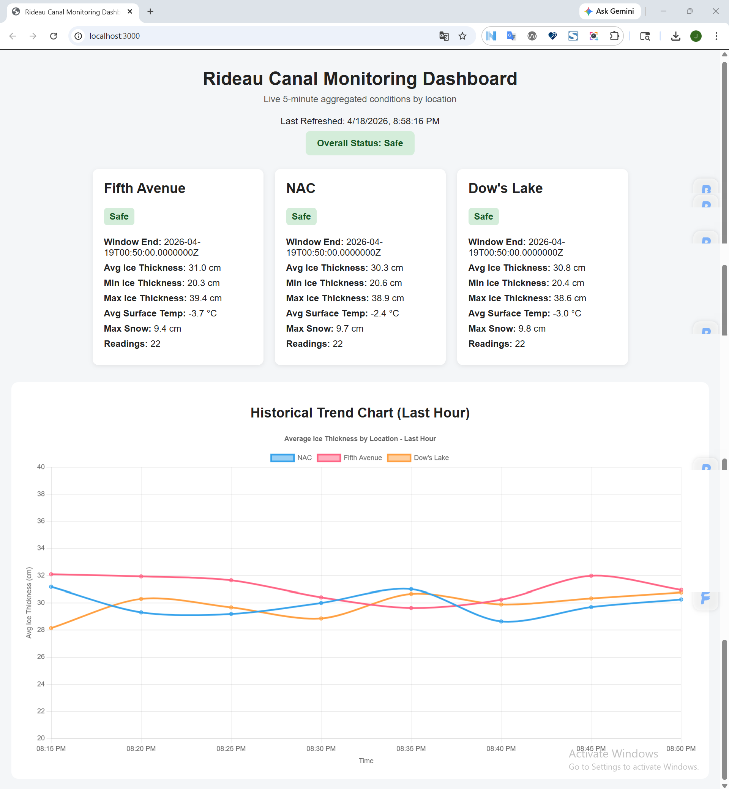
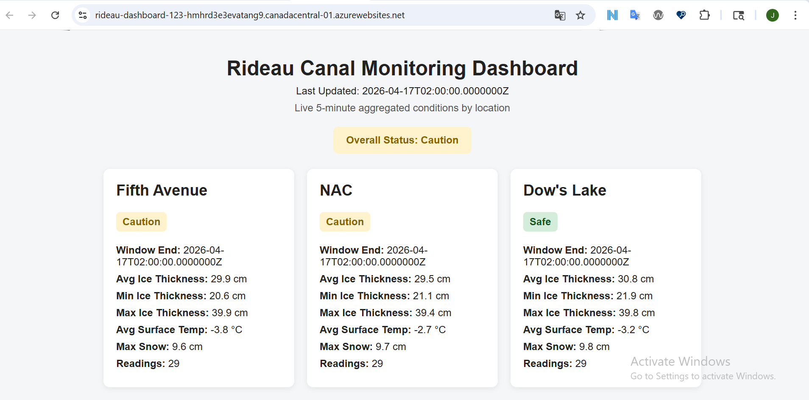

# CST8916 Final Project
# Rideau Canal monitoring system
This project simulates a real-time IoT monitoring system for Rideau Canal.  
It collects sensor data, processes data using Azure Stream Analytics, stores results in CosmosDB,  
keeps backup data files into Blob storage, and shows everything in a live dashboard.  

## Demo Video
https://youtu.be/FcgIQtk7VTk

## Architecture

## Data Flow
1. Sensor simulator generates data (ice thickness, temperature, snow)
2. IoT Hub receives real-time messages
3. Stream Analytics processes and aggregates data every 5 minutes
4. Processed data is stored in:
    * Cosmos DB (for real-time queries)
    * Blob Storage (for historical records)
5. Dashboard displays live results

## Azure Services Used
* IoT Hub – device data ingestion
* Stream Analytics – real-time processing and aggregation
* Cosmos DB – NoSQL storage for processed data
* Blob Storage – historical data storage
* App Service – hosting the web dashboard

## Screenshots
1. IoT Hub Devices

2. IoT Hub Metrics

3. Stream Analytics Query

4. Stream Analytics Running

5. Cosmos DB Data

6. Blob Storage Files

7. Dashboard (Local)

8. Dashboard (Azure)

## Related Repositories
1. rideau-canal-sensor-simulation
https://github.com/Jingjing-Duan/rideau-canal-sensor-simulation

2. rideau-canal-dashboard
https://github.com/Jingjing-Duan/rideau-canal-dashboard

## How to Run
1. Sensor Simulator  
    pip install -r requirements.txt  
    python sensor_simulator.py  

2. Dashboard  
    npm install  
    node server.js  